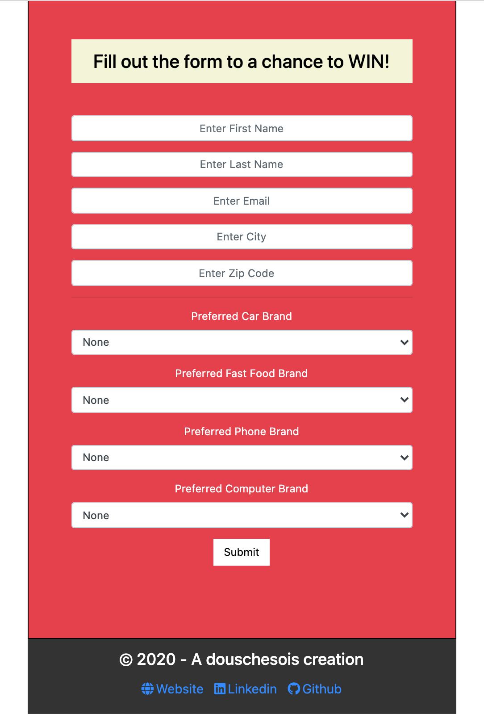
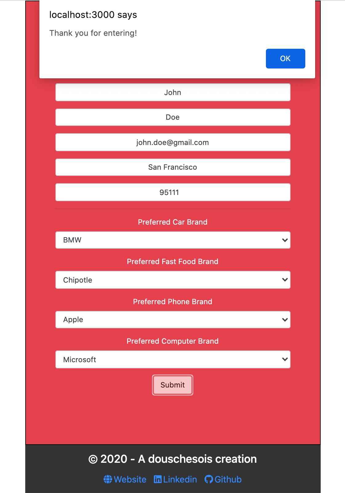

# theSurvey App

This is an App where you can fill out a short survey with your information for a chance to win some gifts! (Not Real).

HTML, CSS, JS, REACT, REDUX, NODE, EXPRESS, MONGODB

Live Link = https://stark-badlands-73143.herokuapp.com/

<h3>Summary</h3>

I wanted to practice my skills and wanted to make a simple full stack application. I also had this idea of just gathering people's preferred choices when it came to things that we use or consume almost everyday. I decided to build this App using React + Redux for the frontend and Node & express for the backend. I chose MongoDB to store the data collected from the user.

I enjoyed building this App because, after completing it, it gave me confidence to continue to learn more and grow as a developer.

<h3>Author</h3>

Roger Alexander - Full Stack Developer <a href="http://www.douschesois.com">Portfolio Website</a>
